# Git Lab 实验报告

姓名：钱彦文

学号：25301030033

课程：计算机系统基础

实验名称：Lab0 Git lab

# 1. 实验目的

本实验旨在学习 Git 的基本使用方法，包括仓库创建、文件修改、暂存与提交、分支管理以及 merge 冲突处理。

通过本实验，理解版本控制系统在软件开发过程中的作用，并掌握 Git 在多人协同开发中的基本工作流程。

# 2. 文档问题回答

## 2.1 多人协同开发经历

此前我没有进行过正式的 Git 多人协同开发。

在过去的小组任务中，通常采用成员分工完成不同模块，再通过即时通信工具或文件共享方式进行整合。

这种方式在项目规模较小时可行，但容易出现版本混乱、修改覆盖以及无法追踪修改历史等问题。

通过本实验，我认识到 Git 可以通过 commit、branch 和 merge 等机制，使多人协作过程更加规范。

## 2.2 为什么 Git 要设计“暂存-提交”两个步骤？

Git 将暂存和提交分为两个步骤，是为了让开发者能够更加灵活地控制一次 commit 中包含的修改内容。

工作区中的修改可能包含多个不同目的的内容，例如功能修改、文档修改或测试代码。

通过 git add，可以选择需要提交的修改进入暂存区；随后 git commit 将暂存区内容保存为一个版本。

这种设计能够使提交记录更加清晰，也方便后续查看历史、回退版本以及团队协作。

## 2.3 git branch 和 git branch -a 的区别

`git branch` 用于查看本地分支。

`git branch -a` 中的 `-a` 表示 all，除了显示本地分支外，还会显示远程跟踪分支。

例如：

- main：本地分支
- remotes/origin/main：远程跟踪分支

因此，`git branch -a` 显示的信息范围比 `git branch` 更广。

# 3. Git commit 及基础操作

首先根据课程要求创建个人 GitHub 仓库，并使用 clone 命令下载到本地。

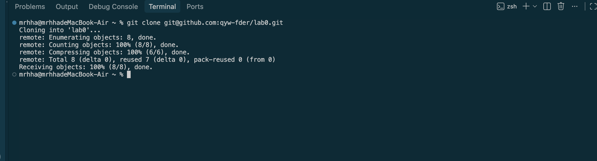

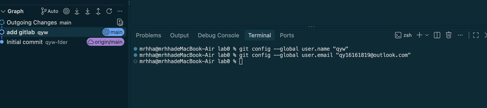

然后修改代码并提交 （add+commit）

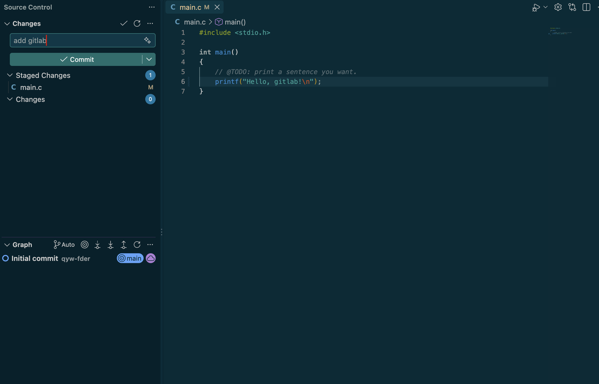

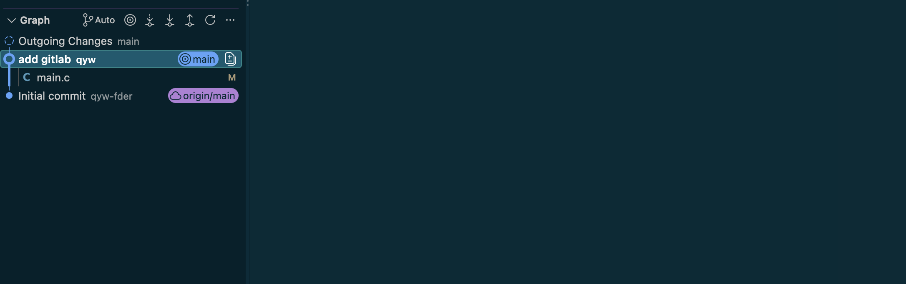

# 4. 扩展阅读与理解

## 4.1 Commit Message 规范

本文主要介绍了如何通过规范化 Git Commit Message 来提高项目维护效率。

在软件开发过程中，一个项目通常会经历大量代码修改，而 Git 中的 commit 记录不仅保存代码变化，也承担着记录修改原因和内容的作用。如果提交信息过于简单，例如只写“修改代码”“修复问题”等，后续开发者很难快速理解某次提交的目的，也不利于项目维护。

文章介绍了一种规范化 Commit Message 的方法，即提交信息应该包含明确的修改类型和具体描述，使每一次提交都能够清晰表达“为什么修改”和“修改了什么”。

文章还介绍了通过规范化提交记录自动生成 Change Log 的思想。由于每次提交都按照统一格式记录，项目可以根据提交历史整理版本变化，帮助开发者和用户了解不同版本之间的区别。

通过阅读本文，我认识到 commit 不只是简单地保存代码版本，更是一种开发者之间交流项目变化的方式。良好的提交信息能够提高团队协作效率，也能够降低后续维护和代码理解的成本。

## 4.2 Git Flow 分支管理

本文主要介绍了 Git Flow 工作流以及如何利用分支管理软件开发过程。

在多人协作开发中，如果所有开发者都直接在 main 分支上修改代码，容易导致代码混乱，也难以区分不同功能的开发过程。因此，Git Flow 提出通过不同类型的分支来管理不同阶段的开发任务。

文章介绍了 Git Flow 中几种主要分支：

- main 分支：保存稳定版本的代码，通常对应正式发布版本；
- develop 分支：用于日常开发，是多个功能合并测试的主要分支；
- feature 分支：用于开发新的功能，每个功能可以拥有独立的开发分支；
- release 分支：用于准备软件发布，对即将发布的版本进行测试和优化；
- hotfix 分支：用于快速修复已经发布版本中的紧急问题。

通过将不同任务隔离在不同分支中，开发者可以减少相互影响，提高多人协作时的开发效率。当某个功能开发完成并测试通过后，再通过 merge 操作将修改合并到对应分支。

通过阅读本文，我认识到 Git 的 branch 不只是简单地复制一份代码，而是一种组织软件开发流程的方法。合理的分支管理能够使不同开发任务并行进行，同时保持主分支代码的稳定性。

## 4.3 为什么要学习 Git？

通过本次实验，我认识到 Git 不仅可以记录代码的修改历史，还能够帮助开发者规范项目开发流程。

Git 通过 commit 保存代码不同阶段的状态，使开发者能够追踪修改历史，并在出现问题时恢复之前的版本。

branch 功能支持多个开发方向同时进行，merge 功能则能够整合不同分支的修改。

在多人协作开发中，不同成员可能同时修改同一个文件，Git 可以检测这些修改之间的冲突，并帮助开发者明确处理冲突。

Commit Message 规范说明了清晰的提交信息对于理解代码修改和维护项目的重要性。Git Flow 分支管理则通过不同分支组织开发任务，使不同功能的开发过程更加清晰。

因此，Git 是现代软件开发中重要的版本控制工具，提高代码管理和协作效率。

# 5. Git 分支管理与冲突解决

在完成基础提交后，我创建 feature 分支，并在该分支中修改 main.c 文件。

修改内容为增加 feature 分支对应的输出信息(增加fromfeature)。

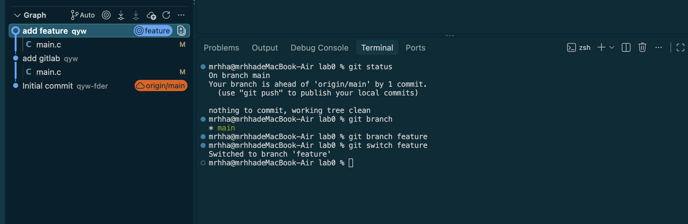

切换回 main 分支后，对 main.c 同一位置进行不同修改并提交（增加frommain），为后续 merge 制造冲突条件。

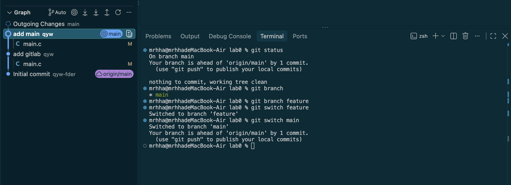

执行 merge 后，由于 main 和 feature 分支修改了同一文件的同一位置，Git 无法自动判断最终版本，因此产生冲突。

查看冲突标记后，我选择保留 main 分支修改，并删除冲突标记。

随后使用 git add 和 git commit 完成冲突解决。

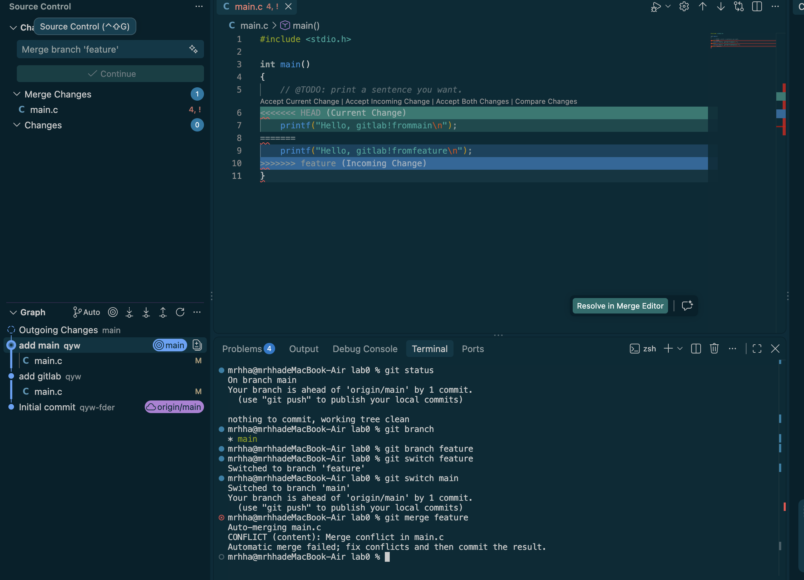

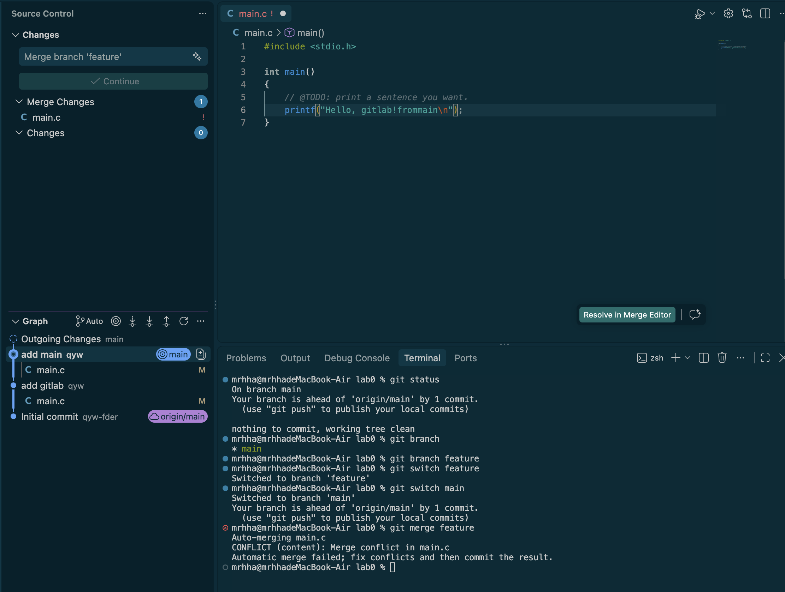

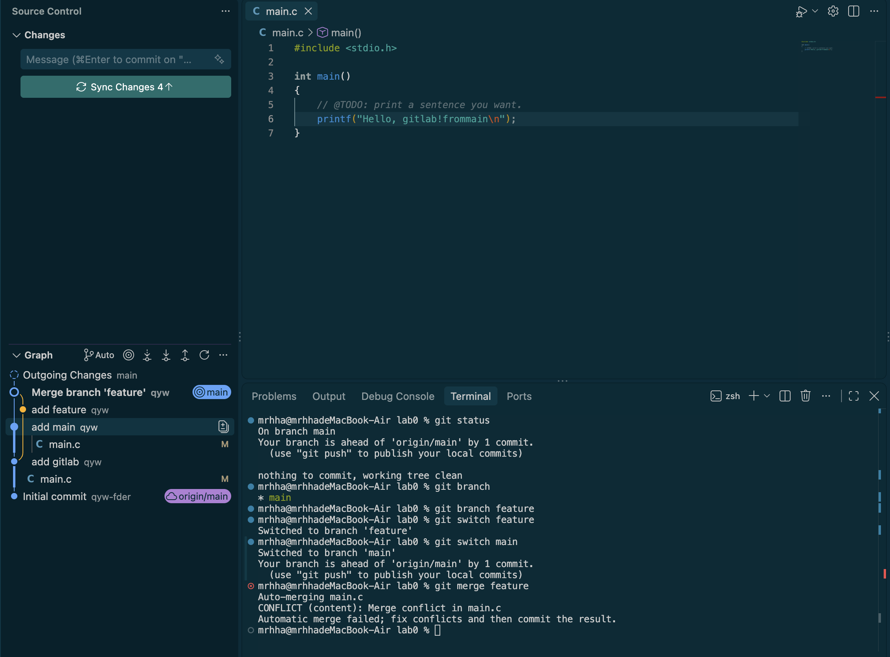

展示所有历史记录 查看merge结果

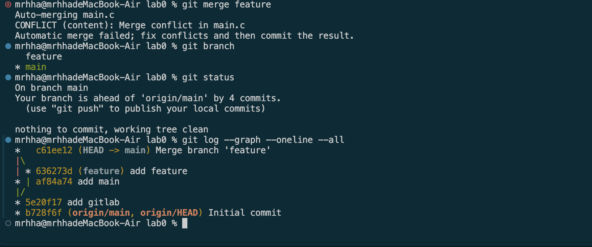

编译运行

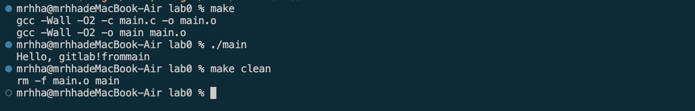

# 6. 提交实验报告

完成报告后，将实验报告加入 main 分支，commit后push

# 7. 实验总结

通过本次 Git Lab 实验，我学习了 Git 的基本工作流程，包括仓库创建、文件修改、暂存、提交、分支创建以及 merge 操作。

实验中，我通过修改同一文件同一位置的方法制造 merge conflict，并进一步理解了 Git 合并冲突产生的原因。

通过手动解决冲突，我认识到 Git 不仅记录代码变化，也帮助开发者管理不同版本之间的关系。在多人协作开发中，开发者仍然需要根据代码逻辑和项目需求判断最终保留的内容。

同时，通过阅读 Commit Message 规范和 Git Flow 相关内容，我了解到 Git 不仅是一种代码保存工具，更是一套用于管理软件开发流程的方法。

# 8. 实验建议

本次实验较好地覆盖了 Git 的基础操作，包括提交管理、分支创建以及冲突解决。

根据本次实验，建议后续实验可以进一步增加远程仓库协作相关内容，例如模拟多人通过不同分支完成开发，并通过 pull request 或代码审核流程完成合并。

这样可以帮助我们进一步理解 Git 在真实软件开发团队中的使用方式。

